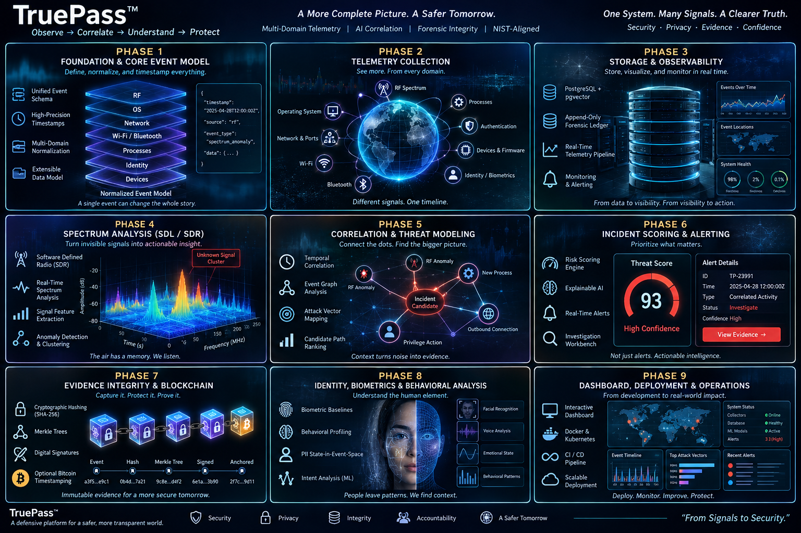
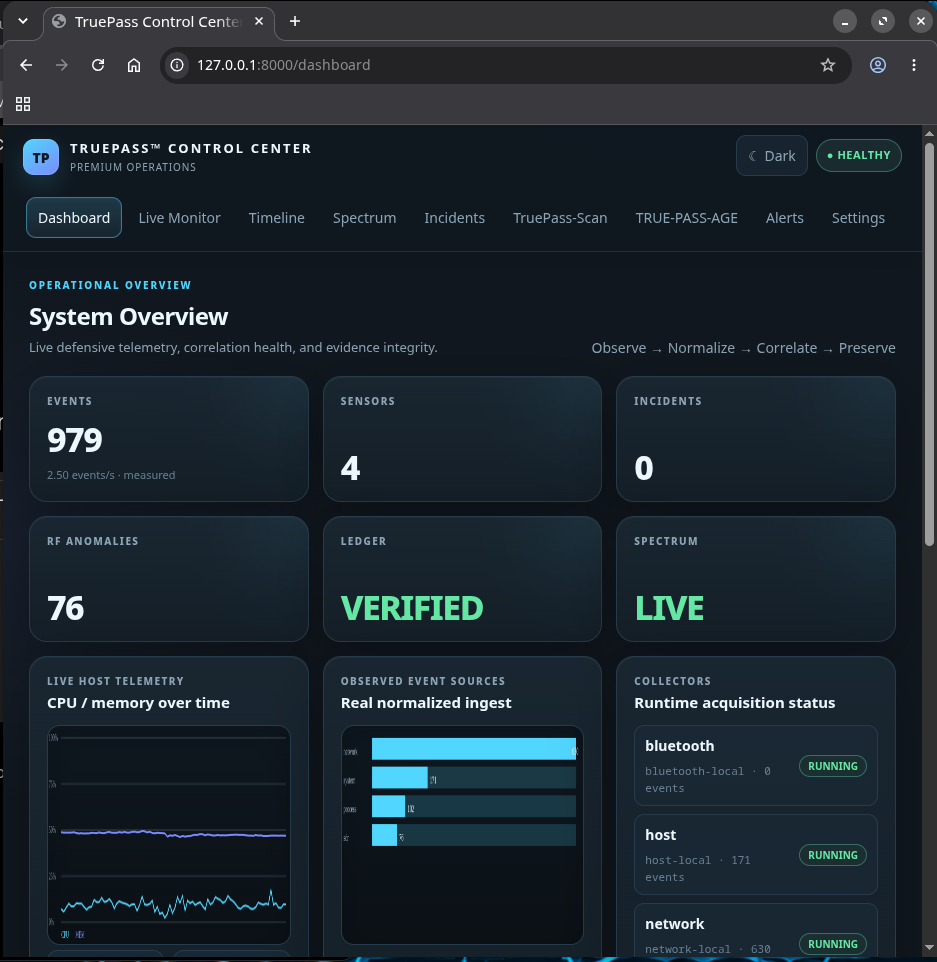
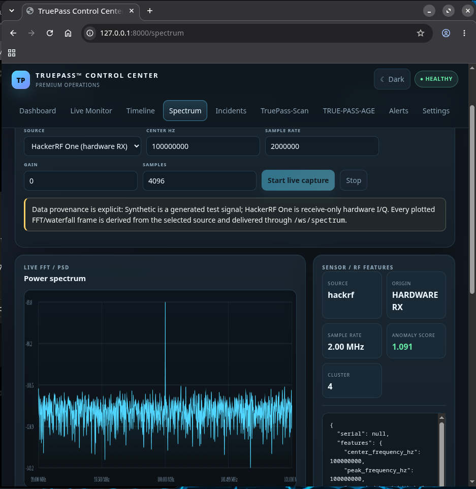

# TruePass™ Correlation Engine

**Defensive multimodal telemetry, anomaly detection, evidence preservation, and forensic correlation.**

> Observe → Timestamp → Normalize → Correlate → Score → Preserve Evidence → Alert

TruePass is a defensive platform built to answer a focused investigation question:

> **Did an RF anomaly coincide with a security-relevant change elsewhere in the monitored system?**

It correlates authorized observations from RF spectrum, processes, sockets/listening ports, Wi-Fi, Bluetooth, identity context, and forensic evidence systems. An anomaly, cluster, similarity match, voice classification, EEG classification, or correlation score is **not proof of compromise, identity, causation, or human intent** by itself.

## Release status

TruePass `1.0.0` now contains the complete source-level implementation through the expanded Overall Definition of Done: Control Center, Live Monitor, Timeline, Spectrum, authorized TruePass-Scan, TRUE-PASS-AGE, Alerts, Settings, realtime APIs, RF intelligence, evidence verification, deployment artifacts, and executable release gates. Run `truepass verify dod --no-external` for the portable implementation gate and `truepass verify dod` on the deployment host for physical HackerRF, PostgreSQL, and Docker verification.

Remediation Phases 2–6 now strengthen runtime diagnostics, passive host/network telemetry, durable evidence-ledger writes, receive-only SDR/HackerRF abstractions, and a bounded DSP frame pipeline. See `docs/DEVELOPMENT_STATUS.md` for the current verified status.

## What TruePass is

TruePass provides passive/read-only telemetry collection, receive-only SDR analysis, deterministic event normalization, explainable anomaly/correlation scoring, PostgreSQL evidence storage, pgvector retrieval, tamper-evident evidence chains, Merkle proofs, Ed25519 commitment signing, optional external timestamp anchoring, APIs, alerting, and a local dashboard.

## What TruePass is not

TruePass is not an exploitation framework, autonomous response engine, RF transmitter, unrestricted mind-reading system, or mechanism for deriving private keys from PII/biometrics/behavior. Voice and EEG modules are isolated research components and cannot independently establish identity or authorize response.

## Screenshots

### TruePass Control Center



### Live HackRF Spectrum Analysis



## Architecture


The primary pipeline is:

```text
Collectors / SDR
      ↓
Canonical Events
      ↓
DSP / Features / Baselines
      ↓
Anomaly & Clustering Observations
      ↓
Temporal Correlation / Event Graph
      ↓
Explainable Incident Score
      ↓
PostgreSQL + Evidence Hash Chain
      ↓
Merkle Root → Ed25519 Signature → Optional Commitment Anchor
      ↓
API / Dashboard / Alerts
```

## Requirements

- Python 3.13+
- PostgreSQL 17+ and pgvector for production persistence/vector search
- Optional Docker + Docker Compose
- Optional HackRF One: SoapySDR + SoapyHackRF supplied by the OS/Conda environment

## Quick start

```bash
python -m venv .venv
. .venv/bin/activate
python -m pip install --upgrade pip
python -m pip install -e '.[dev]'
pytest -q
truepass doctor
truepass run --host 127.0.0.1 --port 8000
```

Open:

```text
http://127.0.0.1:8000/dashboard
http://127.0.0.1:8000/docs
```

## Docker start

```bash
cp .env.example .env
# Replace POSTGRES_PASSWORD before deployment.
docker compose up --build -d
```

Optional Prometheus:

```bash
docker compose --profile monitoring up --build -d
```

The TruePass container runs as a non-root user, drops Linux capabilities, uses a read-only root filesystem, and has a health check.

## Local development and tests

```bash
ruff format --check .
ruff check .
mypy src/truepass
pytest -q
python -m compileall -q src tests
PYTHONPATH=src python scripts/benchmark.py
```

Set `TRUEPASS_TEST_DATABASE_URL` to enable external PostgreSQL integration tests. The automatic synthetic E2E test works without external services and covers RF/Wi-Fi/process/socket events → correlation → incident scoring → SQL persistence → evidence ledger → Merkle proof → API retrieval.

## HackRF One compatibility

HackRF One support is **receive-only** through SoapySDR/SoapyHackRF. TruePass can enumerate a compatible device, select an optional serial, configure RX settings, and capture CF32 I/Q samples. No TX stream/API is exposed.

```bash
truepass collect sdr-hackrf --samples 4096
```

See `docs/HACKRF_ONE.md`.

## Evidence and privacy

Canonical events are deterministically serialized and chained with SHA-256. Merkle roots can be signed with Ed25519. Optional external timestamp anchors receive only 32-byte cryptographic commitments. Raw PII is not placed on public chains, and identity/biometric data is not used as cryptographic private-key entropy.

## Limitations

- Physical SDR behavior depends on local hardware/drivers and permissions.
- Tight temporal correlations are meaningful only when clock quality/uncertainty is understood.
- Baseline/anomaly/cluster scores are analytical aids, not proof of an attacker.
- PostgreSQL/pgvector performance must be benchmarked in the target deployment; the included local benchmark uses SQLite only for portable insert timing.
- Voice/EEG research outputs are experimental and constrained.
- Optional Bitcoin timestamping requires an operator-supplied broadcaster; TruePass manages no wallet funds.

## Security and authorization notice

Use TruePass only on systems, networks, spectrum, and devices you own or are explicitly authorized to monitor. The default architecture is defensive and read-only. Do not treat derived scores as sufficient evidence for punitive or safety-critical action without independent validation.

## Documentation

Start with `docs/ARCHITECTURE.md`, `docs/INSTALLATION.md`, `docs/CONFIGURATION.md`, `docs/SECURITY.md`, `docs/PRIVACY.md`, `docs/EVIDENCE_MODEL.md`, `docs/RF_PIPELINE.md`, `docs/CORRELATION_ENGINE.md`, `docs/API.md`, `docs/DEVELOPMENT.md`, `docs/TROUBLESHOOTING.md`, and `docs/THREAT_MODEL.md`.

## License

Apache-2.0. See `LICENSE`.
