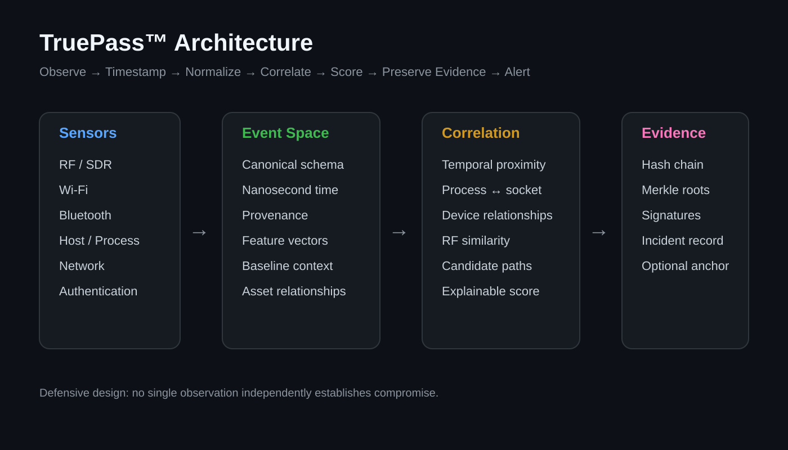
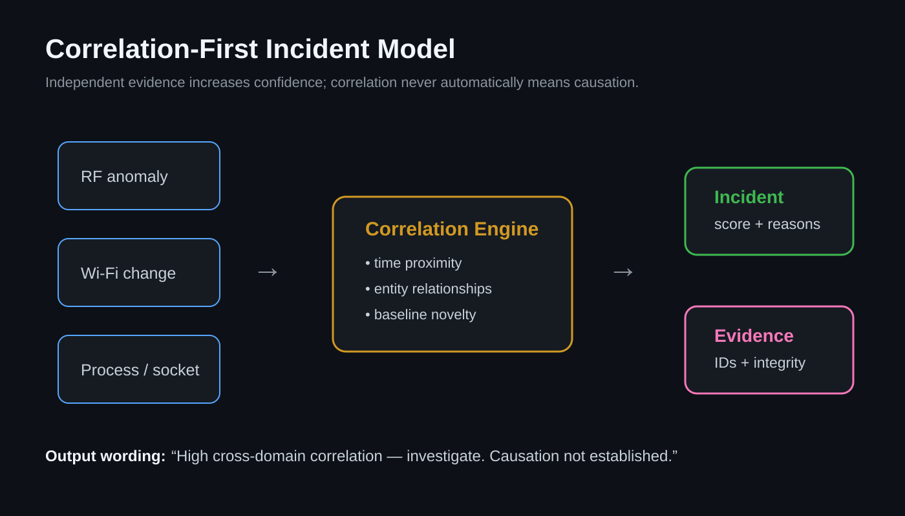
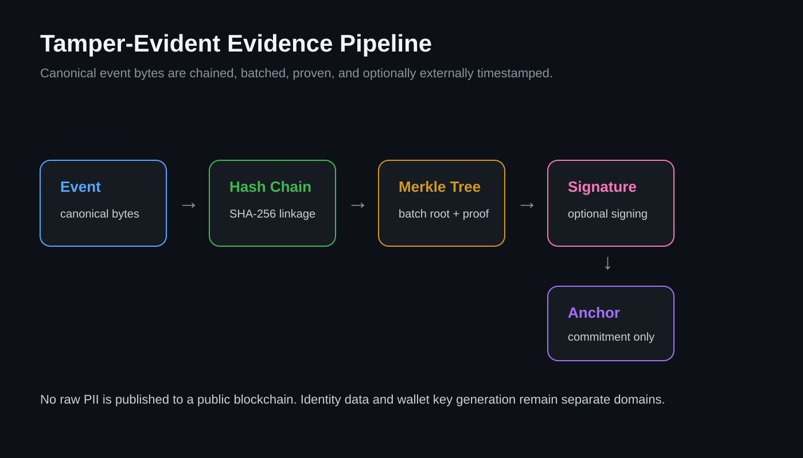

![TruePass architecture](assets/readme/TruePass™: Signals to Security Roadmap.png

# TruePass™ Correlation Engine

**Defensive multimodal telemetry, anomaly detection, evidence preservation, and forensic correlation.**

> Observe → Timestamp → Normalize → Correlate → Score → Preserve Evidence → Alert

TruePass is a defensive research and engineering platform designed to answer a narrow but useful security question:

> **Did an RF anomaly coincide with a security-relevant change elsewhere in the monitored system?**

It correlates authorized observations from RF spectrum, host/process telemetry, network sockets and listening ports, Wi-Fi, Bluetooth, authentication, device state, and evidence-integrity systems. A single anomaly never proves compromise; conclusions must be supported by independent evidence and clearly distinguish correlation from causation.

## Repository status

This repository is the engineering baseline and phased development plan for TruePass. The implementation is intentionally staged so that safe, measurable telemetry and evidence integrity are built before advanced ML or experimental research modules.

## Architecture



## Correlation-first incident model



## Evidence integrity model



## Core design principles

- Defensive use only on local, owned, lab, or explicitly authorized systems.
- Read-only sensor architecture first; no autonomous exploitation or active interference.
- RF observations are measurable signal evidence, not direct human-intent detectors.
- Unknown clusters are observations requiring correlation, not automatic attacker labels.
- Identity, forensic evidence integrity, and wallet/private-key generation remain separate cryptographic domains.
- Cryptographic private keys come from a CSPRNG, never from PII, biometrics, EEG, behavior, emotion, or timestamps.
- Public-chain anchoring, if enabled, stores only cryptographic commitments such as Merkle roots—not raw PII.
- Significant incident scores must be explainable and evidence-linked.

## Development phases

The master development plan defines a complete progression from repository bootstrap through event modeling, telemetry, SDR/DSP, anomaly detection, temporal correlation, incident scoring, graph analysis, pgvector similarity, forensic hashing, optional timestamp anchoring, APIs, UI, hardening, deployment, documentation, CI/CD, and release.

The first engineering milestone is deliberately modest and testable:

```text
Host/process/network telemetry
          +
Synthetic or real SDR observations
          ↓
Canonical event normalization
          ↓
Temporal correlation
          ↓
Explainable incident candidate
          ↓
Tamper-evident evidence ledger
```

See [`docs/TRUEPASS_MASTER_PLAN.md`](docs/TRUEPASS_MASTER_PLAN.md) for the full phased specification.

## NIST alignment

TruePass is designed with reference to NIST CSF 2.0 and current NIST incident-response principles: understand assets, attack vectors and attack surfaces; collect observations; analyze and correlate evidence; prioritize risk; and preserve evidence supporting response decisions.

This repository does **not** claim NIST certification or compliance merely by adopting those principles.

## Suggested technology stack

Python 3.13+, FastAPI, Pydantic, SQLAlchemy 2.x, PostgreSQL + pgvector, Alembic, Polars, NumPy, SciPy, scikit-learn, optional PyTorch, SoapySDR/GNU Radio integration, psutil, Scapy, NetworkX, `cryptography`, Prometheus, Plotly, pytest, Ruff, mypy, Docker, Docker Compose, and GitHub Actions.

## Repository layout

```text
TruePass-Correlation-Engine/
├── README.md
├── LICENSE
├── pyproject.toml
├── .gitignore
├── assets/
│   └── readme/
│       ├── phase-architecture.svg
│       ├── phase-correlation.svg
│       └── phase-evidence.svg
├── docs/
│   └── TRUEPASS_MASTER_PLAN.md
├── src/
│   └── truepass/
│       └── __init__.py
└── tests/
```

## Safety and authorization

TruePass is intended for defensive monitoring and research. Network inspection, port inventory, wireless telemetry, and packet analysis must only be used against systems and networks the operator owns or is explicitly authorized to monitor. The project should not implement credential theft, persistence, malware deployment, destructive remote actions, or autonomous exploitation.

## License

Apache-2.0. See [`LICENSE`](LICENSE).
